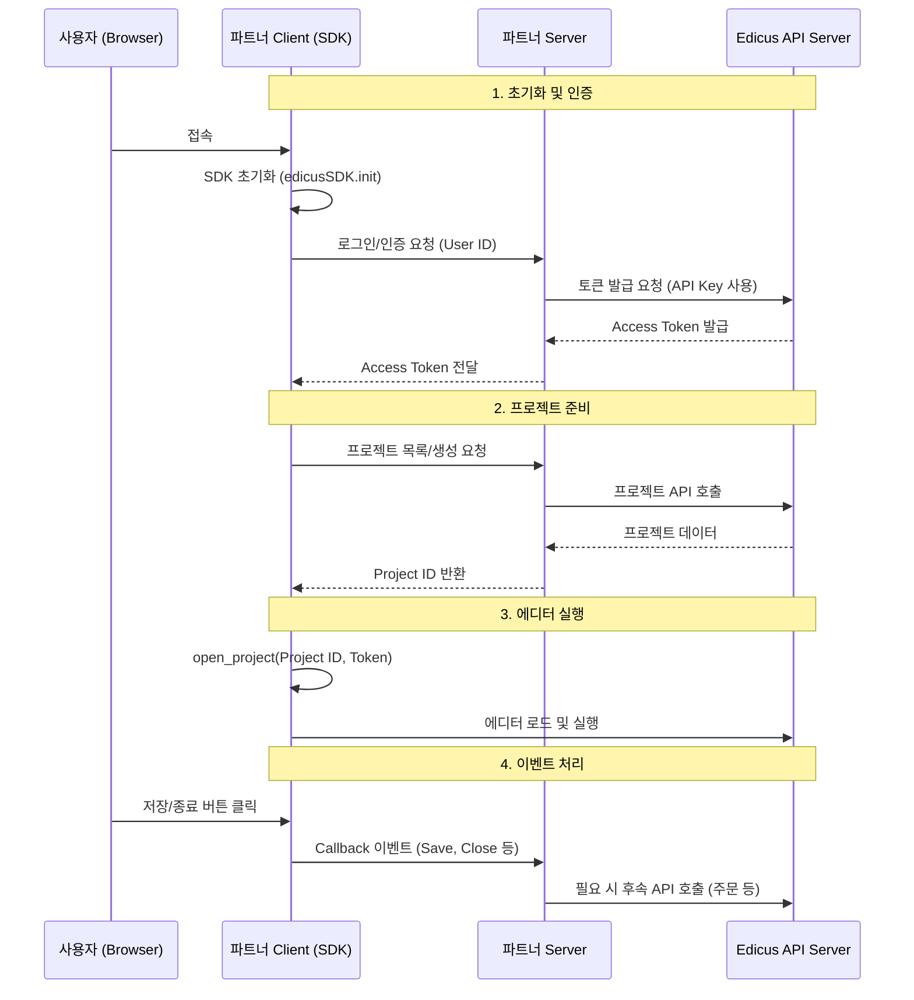

# Edicus Basic Demo 개발자 가이드

이 문서는 `demo-basic` 프로젝트를 기반으로 Edicus 편집기를 웹 애플리케이션에 연동하는 전체적인 흐름을 설명합니다.

## 1. 아키텍처 개요

Edicus 연동은 크게 **프론트엔드(Client)**, **파트너 서버(Partner Server)**, 그리고 **Edicus API 서버** 3자 간의 통신으로 이루어집니다.

> **⚠️ 중요**: `demo-basic` 예제에서는 편의상 `server.js`가 브라우저에서 직접 Edicus API를 호출하도록 구현되어 있으나, **실제 상용 환경에서는 API Key 보안을 위해 반드시 고객사 백엔드 서버를 거쳐 통신해야 합니다.**

### 데이터 흐름도



---

## 2. 주요 파일 구성

`demo-basic` 폴더 내의 핵심 파일들은 다음과 같은 역할을 합니다.

| 파일명 | 역할 및 설명 |
|--------|--------------|
| `index.html` | SDK 스크립트(`edicus-sdk-v2.js`) 로드 및 UI 레이아웃 |
| `index.js` | 프론트엔드 메인 로직. SDK 초기화, UI 이벤트 바인딩 처리 |
| `server.js` | **(중요)** 백엔드 API 시뮬레이션. 실제로는 백엔드 서버에서 구현해야 할 로직들입니다. |
| `open-editor.js` | 에디터를 실제로 화면에 띄우고, 에디터로부터 오는 콜백(Callback)을 처리합니다. |
| `project.js` | 프로젝트 복제, 삭제, 썸네일 조회 등 관리 기능을 담당합니다. |

---

## 3. 단계별 구현 가이드

### Step 1: SDK 로드 및 초기화

HTML 파일에서 SDK를 로드하고, 스크립트 진입점에서 초기화를 수행합니다.

```html
<!-- index.html -->
<script src="../edicus-sdk-v2.js"></script>
```

```javascript
// index.js
let editor = window.edicusSDK.init({});
```

### Step 2: 사용자 인증 (Token 발급)

Edicus 편집기를 사용하기 위해서는 사용자별 **Access Token**이 필요합니다.

1.  클라이언트가 백엔드에 현재 사용자의 ID(`uid`)로 토큰을 요청합니다.
2.  백엔드는 `edicus-api-key`를 헤더에 담아 Edicus API 서버(`/api/auth/token`)를 호출합니다.
3.  발급받은 토큰을 클라이언트로 전달합니다.

```javascript
// server.js (백엔드 로직 예시)
export async function get_custom_token(user_id) {
    const url = server_env.apiHost + '/api/auth/token';
    const headers = { 
        'edicus-api-key': 'YOUR_API_KEY', // 절대 클라이언트에 노출 금지
        'edicus-uid': user_id 
    };
    // ... API 호출 후 토큰 반환
}
```

### Step 3: 프로젝트 생성 및 선택

에디터를 열기 위해서는 **Project ID**가 필요합니다. 기존 프로젝트 목록을 불러오거나, 템플릿을 기반으로 새 프로젝트를 생성합니다.

*   **목록 조회**: `GET /api/projects`
*   **신규 생성**: `editor.create_project()` SDK 함수 사용

```javascript
// index.js (신규 생성 예시)
var params = {
    ps_code: 'PS_CODE',       // 상품 코드
    template_uri: 'URI...',   // 템플릿 URI
    token: client_env.user_token, // 발급받은 토큰
    // ...
}

editor.create_project(params, function (err, data) {
    if (data.action == 'project-id-created') {
        // 생성된 프로젝트 ID 확인
        console.log(data.project_id);
    }
});
```

### Step 4: 에디터 열기 (Open Editor)

`open_project` 함수를 사용하여 에디터를 실행합니다. 이때 `callback` 함수를 함께 전달하여 에디터 내부 이벤트를 수신합니다.

```javascript
// open-editor.js
export function openEditor(context) {
    var params = {
        parent_element: document.getElementById("edicus_container"), // 에디터가 들어갈 DOM
        token: context.client_env.user_token,
        prjid: context.projectId,
        // ...
    }

    // 콜백 함수 등록
    editor.open_project(params, function(err, data) {
        // 이벤트 처리 (저장, 종료 등)
        if (data.action === 'close') {
            context.closeEditor();
        } else if (data.action === 'save-doc-report' && data.info.status === 'end') {
            console.log('저장 완료:', data);
        }
    });
}
```

---

## 4. 보안 주의사항 (Security Checklist)

1.  **API Key 보호**: `edicus-api-key`는 절대 브라우저(클라이언트) 코드에 포함되어서는 안 됩니다. `demo-basic/server.js`의 내용은 반드시 귀사의 백엔드 서버(Java, Python, Node.js 등)로 이관하여 구현해야 합니다.
2.  **UID 관리**: `edicus-uid`는 사용자를 식별하는 고유 키입니다. 개인정보(이메일, 전화번호 등)를 직접 사용하지 말고, 내부 식별자(UUID 등)를 사용하는 것을 권장합니다.

## 5. 참고 문서

*   **API 명세서**: 소스 코드 내 주석에 포함된 Google Docs 링크를 참조하세요.
*   **환경 설정**: 루트 디렉토리의 `.server-env.js`와 `.client-env.js`에서 API Host 및 Partner 설정을 확인하세요.

