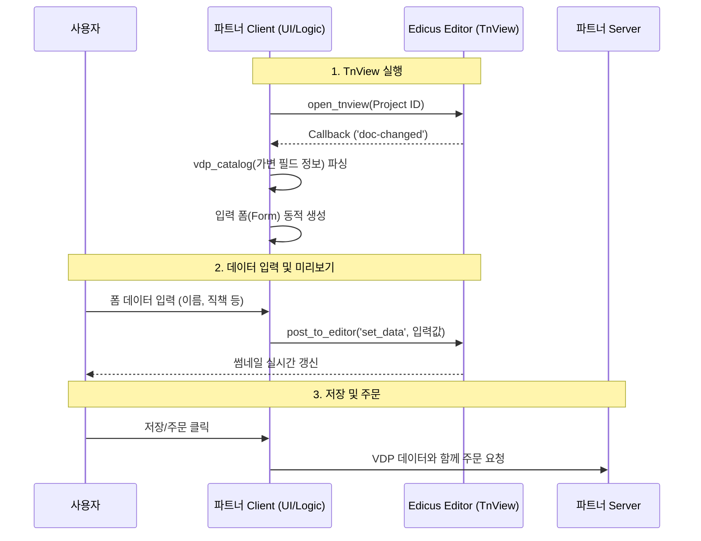

# Edicus VDP(Variable Data Printing) Demo 개발자 가이드

이 문서는 `demo-vdp` 프로젝트를 기반으로 Edicus의 가변 데이터 인쇄(VDP) 기능을 웹 애플리케이션에 연동하는 방법을 설명합니다. VDP 모드는 사용자가 디자인을 직접 수정하는 대신, **정해진 템플릿에 데이터만 입력하여 결과물을 미리 보고 주문하는 워크플로우**에 최적화되어 있습니다.

## 1. VDP 아키텍처 및 흐름

VDP 데모의 핵심은 **TnView (Thumbnail View)** 모드입니다. 이는 전체 편집기 UI 대신, 미리보기 화면만 렌더링하고 외부(Host App)에서 데이터를 주입하여 실시간으로 결과물을 확인하는 방식입니다.

### 데이터 흐름도



---

## 2. 주요 파일 구성

`demo-vdp`는 `demo-basic`과 유사한 구조를 가지며, VDP 처리를 위한 파일이 추가되었습니다.

| 파일명 | 역할 및 설명 |
|--------|--------------|
| `index.js` | VDP 데모의 메인 진입점. 폼 생성 및 UI 이벤트를 총괄합니다. |
| `open-tnview.js` | **(핵심)** `open_tnview` API를 사용하여 에디터를 뷰어 모드로 실행하고, 콜백을 처리합니다. |
| `vdp-storage.js` | 사용자가 입력한 가변 데이터(VDP Data)를 브라우저 로컬 스토리지에 저장/로드합니다. |
| `context.js` | 애플리케이션 상태(프로젝트 정보, VDP 데이터 등)를 관리합니다. |
| `vdp-util.js` | VDP 데이터 처리를 위한 유틸리티 함수 모음입니다. |

---

## 3. 단계별 구현 가이드

### Step 1: TnView 모드로 프로젝트 열기

일반 편집기 모드(`open_project`) 대신 `open_tnview`를 사용하여 프로젝트를 엽니다. 이 모드는 툴바나 편집 도구 없이 결과물만 보여줍니다.

```javascript
// open-tnview.js
function open_tnview(context, callback) {
    let params = {
        parent_element: document.getElementById("edicus_container"),
        prjid: context.projectId,
        token: context.client_env.user_token,
        // 초기 데이터 주입 (저장된 데이터가 있을 경우)
        data_row: context.vdpUtil.initialDataRows 
    };

    // TnView 모드 실행
    editor.open_tnview(params, callback);
}
```

### Step 2: VDP 스키마 수신 및 폼 생성

에디터가 로드되면 `doc-changed` 이벤트가 발생하며, 이때 템플릿에 정의된 가변 필드 정보(`vdp_catalog`)가 전달됩니다. 이를 바탕으로 입력 폼을 생성합니다.

```javascript
// open-tnview.js (Callback 내부)
function handleDocChanged(data, context) {
    // vdp_catalog: 템플릿의 가변 필드 목록 (예: 이름, 전화번호 필드 등)
    let vdp_catalog = data.info.vdp_catalog;
    
    if (vdp_catalog) {
        context.vdpUtil.setVdpCatalog(vdp_catalog);
        // 필드 정보에 따라 <input> 태그 등을 동적으로 생성
        context.build_form_fields(); 
    }
}
```

### Step 3: 실시간 데이터 반영 (Post to Editor)

사용자가 폼에 데이터를 입력할 때마다 `set_data` 액션을 에디터로 보내 미리보기를 갱신합니다.

```javascript
// 사용자가 입력 필드를 변경했을 때 호출
function onInputChange(fieldName, value) {
    // 전송할 데이터 포맷 구성
    let dataRow = {
        [fieldName]: value
    };

    // 에디터에 데이터 주입 요청
    editor.post_to_editor("set_data", {
        data_row: dataRow,
        render_mode: "current_page" // 현재 페이지만 갱신하여 성능 최적화
    });
}
```

### Step 4: VDP 데이터 저장

일반 프로젝트와 달리 VDP 프로젝트는 **디자인 원본은 변하지 않고, 입력된 데이터(VDP Data)만 별도로 관리**합니다. `demo-vdp`에서는 `VdpStorage`를 이용해 이를 시뮬레이션합니다.

```javascript
// index.js
function on_save_vdp() {
    // 현재 입력된 폼 데이터를 가져옴
    const currentData = context.getVdpData();
    // 로컬 스토리지에 저장 (실제 구현 시 서버 DB에 저장)
    context.vdpStorage.save(context.projectId, currentData);
}
```

### Step 5: 주문 접수 (VDP 데이터 포함)

주문 시에는 프로젝트 ID와 함께 최종 입력된 VDP 데이터를 서버로 전송해야 합니다.

```javascript
// server.js (API 호출 예시)
export async function tentative_order_project_with_vdp(user_id, project_id, orderData) {
    // orderData 내부에 vdp_data가 포함되어야 함
    const url = server_env.apiHost + '/api/projects/' + project_id + '/order/tentative_with_vdp';
    // ... API 호출
}
```

---

## 4. 핵심 포인트 요약

1.  **TnView 모드**: `open_project`가 아닌 `open_tnview`를 사용합니다.
2.  **동적 폼 생성**: 에디터가 주는 `vdp_catalog` 정보를 이용해 UI를 구성하므로, 템플릿이 변경되어도 코드를 수정할 필요가 없습니다.
3.  **데이터 분리**: 디자인(Template)과 데이터(VDP Data)가 분리되어 관리됩니다. 실제 주문 시스템 구현 시 이 데이터를 주문 정보와 함께 저장해야 합니다.

## 5. 참고 문서

*   **API 명세서**: 소스 코드 내 주석의 Google Docs 링크 참조.
*   **VDP 데이터 구조**: `vdp-util.js` 및 `vdp_catalog` 데이터 구조를 참고하여 데이터 매핑 로직을 이해하세요.


