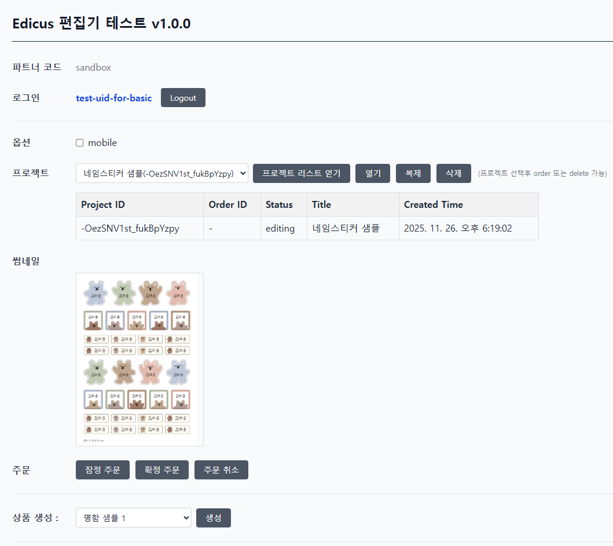
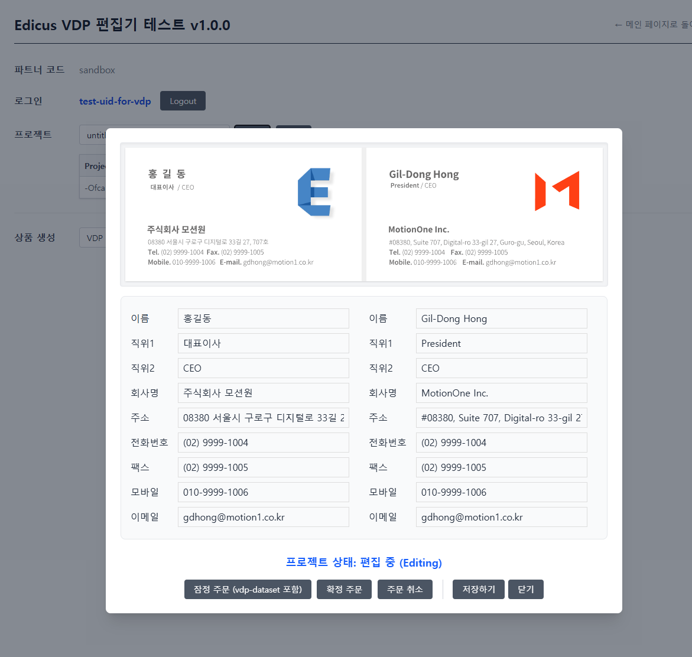

# Edicus Cloud Editor 데모 코드
에디쿠스 편집기 데모 페이지입니다. 

## 개요
- edicus편집기 운용방식과 ediusSDK를 사용하는 방법을 파악하기 위한 용도입니다.
- 4300 port로 index.html을 웹서버로 서비스 해야 합니다.
- 실제 데모를 운용해 보기 위해서는 모션원으로부터 apiKey를 발급받아야 합니다.

## 테스트용 Edicus Api 발급
- 테스트용 Edicus Server API key를 모션원에 요청하여 발급 받아야 합니다.
- 테스트용 계정 id는 "sandbox" 입니다.


## 사전 작업
- 프로젝트의 root 폴더에 `.server-env.js`와 `.client-env.js` 파일을 생성해야 합니다.
- 이 두 파일은 버전관리 되지 않도록 .gitignore에서 등록되어 있습니다. (apiKey가 노출되지 않도록 각별히 주의해야 합니다.)
- 각 파일은 `.server-env.sample.js`와 `.client-env.sample.js`를 참고 바랍니다. partner코드가 "sandbox"인 경우에 대한 샘플입니다.
```javascript
// .server-env.js


export let server_env = {
    apiHost: 'https://api-dot-edicusbase.appspot.com',
	apiKey: '발급받은 edicus api key를 입력하세요' // 모션원에서 발급받은 api를 입력해야 합니다.
}
```

```javascript
// .client-env.js

// 발급받은 partner 코드 (.server-env.js 파일의 apiKey는 이 partner 코드로 발급받은 키를 사용해야 합니다.)
export let partner = "sandbox"; 

export let edicusBasicTemplates = [
	{
		ps_code: '90x50@NC',
		template_uri: 'gcs://template/partners/sandbox/res/template/2704164.json',
		title: '명함 샘플 1',
	},
]

export let edicusVdpTemplates = [
	{
		ps_code: '90x50@NC',
		template_uri: 'gcs://template/partners/sandbox/res/template/3113133.json',
		title: 'VDP 명함 샘플 1',
	},
]
```

## 가이드 문서

- [Edicus 기본 편집기 데모 가이드](./demo-basic/readme.md)
- [Edicus VDP 데모 가이드](./demo-vdp/readme.md)
- [주문 프로세스 가이드](./ORDER_PROCESS.md)

## 의존성
기능 파악을 목적으로 하기 때문에 아래 라이브러리만 사용합니다.
- JQuery
- [tailwindcss](https://tailwindcss.com/) - 컴팩트한 css 처리를 위해 사용

## http-server로 사이트 서비스
중요 : 이 데모페이지를 public domain으로 서비스 하지 않도록 해야 합니다. (서버측에서 구현되어야 할 코드가 이해를 돕기위해 브라우저단에서 구현되어 있는 관계로 apiKey가 유출될 수 있습니다.)
- 설치 : `npm install --global http-server` ([http-server github 페이지](https://github.com/http-party/http-server))
- 실행 : `http-server -c-1 -p 4300`
- 참고 : 이 프로젝트의 루트 폴더를 웹으로 서비스할 수 있으면 어떤 방법이든 상관없습니다.


## 테스트 사이트 접속
- `http://localhost:4300`

## Edicus 문서
- [Edicus Javascript SDK](https://docs.google.com/document/d/1buvh-TjQtAqddAD4-QFxBHKFDESRxInsxFcViuEwNZc/edit?tab=t.0)  
- [Edicus Server API](https://docs.google.com/document/d/1OhWdgv9Sz8By4N48eY0uO_84M3keLVQvdpdpK9u_3bA/edit?tab=t.0#)

## 화면 캡쳐
기본 편집기 데모



편집기


VDP 편집기 데모

